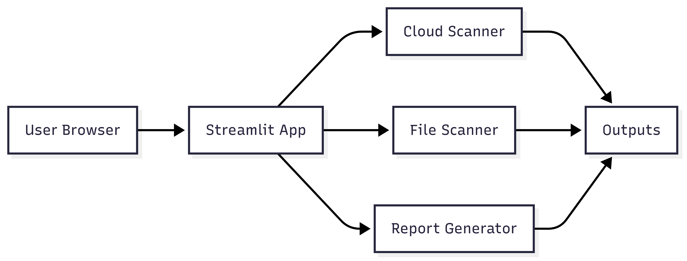

# 🔐 Cloud Security Analyzer

A comprehensive security scanning tool for detecting cloud misconfigurations and sensitive data leaks in files. Built with Python and Streamlit for easy deployment and use.

## 🌐 **Live Demo**
**🚀 Try it now:** [https://cloud-security-scanner.streamlit.app/](https://cloud-security-scanner.streamlit.app/)

## 👨‍💻 **Developer**
**ASHUTOSH KUMAR**  
Bachelor's in Computer Science, IIT Patna (3rd Year)  
GitHub: [@ashutosh8021](https://github.com/ashutosh8021)



## ✨ Features

### 🔍 **Current Capabilities (v1.0)**
- **☁️ Cloud URL Scanner**: Detect publicly accessible cloud storage objects (S3, Azure Blob, GCS)
- **📂 File Content Analysis**: Scan TXT, PDF, DOCX files for sensitive data
- **🇮🇳 Indian Compliance**: Built-in detection for Aadhaar, PAN numbers
- **📧 Contact Information**: Email and phone number detection
- **🔒 Password Detection**: Basic password pattern identification
- **📊 Interactive Dashboard**: Visual risk distribution and metrics
- **📄 Report Generation**: Export results as PDF/CSV
- **🎨 Modern UI**: Clean, intuitive Streamlit interface
- **🧪 Test Coverage**: Comprehensive unit tests with pytest

### 🚀 **Planned Enhancements (v2.0 - Future)**
- **🤖 ML-Powered Detection**: Advanced anomaly detection using machine learning
- **🌐 Multi-Cloud Support**: Enhanced AWS, Azure, GCP, DigitalOcean support
- **📊 Real-time Dashboard**: Live monitoring with threat intelligence
- **🔌 REST API**: Enterprise automation and integration capabilities
- **📅 Scheduled Scanning**: Automated periodic security assessments
- **🔔 Webhook Integration**: SIEM/SOAR platform connectivity
- **⚖️ Advanced Compliance**: GDPR, PCI DSS, SOX, HIPAA frameworks

## 🚀 Quick Start

### Option 1: Streamlit Cloud (Recommended for Demo)

1. **Fork this repository** on GitHub
2. **Visit [share.streamlit.io](https://share.streamlit.io)**
3. **Connect your GitHub account**
4. **Deploy** by selecting this repository
5. **Access** your live application

### Option 2: Local Development

```bash
# Clone the repository
git clone <repository-url>
cd cloud-security-analyzer

# Install dependencies
pip install -r requirements.txt

# Run the application
streamlit run app.py
```

### Option 3: Virtual Environment (Recommended for Local)

```bash
# Create virtual environment
python -m venv venv

# Activate virtual environment
# Windows:
venv\Scripts\activate
# Linux/Mac:
source venv/bin/activate

# Install dependencies
pip install -r requirements.txt

# Run application
streamlit run app.py
```

## 📖 Usage Guide

### 🌐 Cloud URL Scanning

1. **Navigate to the "☁️ Scan Cloud URL" tab**
2. **Enter a cloud storage URL** (e.g., `https://my-bucket.s3.amazonaws.com/data.csv`)
3. **Click "🔎 Scan URL"** to analyze the target
4. **Review results** including:
   - Risk level assessment
   - HTTP status and accessibility
   - Security recommendations

**Supported Cloud Providers:**
- Amazon S3 (`s3.amazonaws.com`)
- Azure Blob Storage (`blob.core.windows.net`)
- Google Cloud Storage (`storage.googleapis.com`)
- DigitalOcean Spaces (`digitaloceanspaces.com`)

### 📁 File Content Analysis

1. **Navigate to the "📂 Analyze File" tab**
2. **Upload a file** (TXT, PDF, or DOCX format)
3. **Click "📑 Analyze File"** to scan content
4. **Review findings** for sensitive data including:
   - Aadhaar numbers (Indian national ID)
   - PAN numbers (Indian tax ID)
   - Email addresses
   - Phone numbers
   - Password patterns

### 📊 Security Dashboard

1. **Navigate to the "📊 Dashboard" tab**
2. **View risk distribution** charts and metrics
3. **Monitor security trends** and statistics
4. **Export reports** for compliance documentation

## 🛡️ Security Patterns Detected

| Data Type | Pattern | Example | Risk Level |
|-----------|---------|---------|------------|
| Aadhaar | `XXXX XXXX XXXX` | `1234 5678 9012` | High |
| PAN | `AAAAA9999A` | `ABCDE1234F` | High |
| Email | Standard format | `user@domain.com` | Medium |
| Phone | 10-digit Indian | `9876543210` | Medium |
| Password | 8+ chars with letters/numbers | `Pass@1234` | High |

## 🏗️ Project Structure

```
cloud-security-analyzer/
├── app.py                 # Main Streamlit application
├── requirements.txt       # Python dependencies
├── README.md             # Project documentation
├── PHASE2_ROADMAP.md     # Future enhancement plan
├── .gitignore            # Git ignore rules
├── .streamlit/           # Streamlit configuration
│   └── config.toml
├── core/                 # Core scanning modules
│   ├── cloud_scanner.py  # Cloud URL analysis
│   ├── data_scanner.py   # File content scanning
│   └── report_generator.py # PDF/CSV reports
├── utils/                # Utility functions
│   ├── file_loader.py    # File processing
│   └── regex_patterns.py # Detection patterns
├── tests/                # Unit tests
│   ├── test_cloud.py     # Cloud scanner tests
│   └── test_data.py      # Data scanner tests
├── sample_data/          # Test files
├── docs/                 # Documentation assets
└── github/workflow/      # CI/CD configuration
    └── tests.yml
```

## 🧪 Testing

```bash
# Run all tests
python -m pytest tests/ -v

# Run with coverage
python -m pytest tests/ --cov=core --cov=utils

# Run specific test file
python -m pytest tests/test_cloud.py -v
```

## 📊 Use Cases

### 🏢 **Small/Medium Business**
- **Daily security audits** of cloud storage
- **Compliance preparation** for data protection laws
- **Employee training** on data security
- **Incident response** for data breach investigation

### 🏛️ **Enterprise Organizations**
- **Multi-cloud governance** and monitoring
- **Compliance automation** (GDPR, industry standards)
- **DevSecOps integration** in CI/CD pipelines
- **Executive security reporting**

### 🛡️ **Security Teams**
- **Threat hunting** and investigation
- **Vulnerability assessment** automation
- **Compliance auditing** and documentation
- **Security awareness** training support

## 🔧 Configuration

### Streamlit Cloud Deployment
No additional configuration needed! Just deploy to Streamlit Cloud and it works out of the box.

### Local Development
```bash
# Optional environment variables
export STREAMLIT_SERVER_PORT=8501
export STREAMLIT_SERVER_ADDRESS=localhost
```

### Custom Patterns
Add custom regex patterns in `utils/regex_patterns.py`:
```python
PATTERNS = {
    "custom_id": r"CUSTOM-\d{6}",
    # Add your patterns here
}
```

## 📈 Performance

- **Scanning Speed**: ~1-3 seconds per cloud URL
- **File Processing**: ~0.5-2 seconds per MB
- **Memory Usage**: ~50-100MB base footprint
- **Concurrent Users**: 10-50 (depending on deployment)

## 🔐 Security Considerations

- **No data storage**: Files are processed in memory only
- **No external calls**: Except for cloud URL verification  
- **Privacy-focused**: Sensitive data is never logged or stored
- **Streamlit Cloud**: Runs in secure, managed environment

## 🚨 Limitations (Current Version)

- **Basic pattern matching**: Uses regex, not ML-based detection
- **Limited cloud providers**: Core providers only
- **No real-time monitoring**: Manual scanning only
- **No API access**: Web interface only
- **Single-user**: No multi-tenant support

## 🔮 Roadmap (Phase 2 Enhancements)

### 🎯 **Short-term (3-6 months)**
- [ ] ML-powered anomaly detection
- [ ] Enhanced cloud provider APIs
- [ ] REST API for automation
- [ ] Scheduled scanning capabilities
- [ ] Advanced compliance frameworks

### 🚀 **Medium-term (6-12 months)**
- [ ] Real-time monitoring dashboard
- [ ] Multi-tenant architecture
- [ ] Webhook integrations
- [ ] Advanced threat intelligence
- [ ] Mobile application

### 🌟 **Long-term (12+ months)**
- [ ] AI-powered risk prediction
- [ ] Automated remediation
- [ ] Third-party integrations
- [ ] Enterprise SSO
- [ ] Global threat sharing

## 📞 Support & Contributing

### 🐛 **Issues & Bugs**
- Create an issue with detailed reproduction steps
- Include system information and error logs
- Add screenshots for UI-related issues

### 🔧 **Contributing**
- Fork the repository
- Create feature branch: `git checkout -b feature-name`
- Commit changes: `git commit -m 'Add feature'`
- Push to branch: `git push origin feature-name`
- Submit pull request

### 📧 **Contact**
- **Documentation**: Check the `/docs` folder
- **Issues**: Use GitHub Issues
- **Security**: Report via private communication

## 📜 License

This project is licensed under the MIT License - see the LICENSE file for details.

## 🙏 Acknowledgments

- **Streamlit**: For the amazing web framework
- **Python Security**: Community patterns and best practices
- **Open Source**: All the fantastic libraries used

---

**⚡ Ready to secure your cloud infrastructure?**

[](https://share.streamlit.io)

```bash
# Quick local start
git clone <your-repo-url>
cd cloud-security-analyzer
pip install -r requirements.txt
streamlit run app.py
```

🌐 **Live Demo**: [Your Streamlit App URL]
